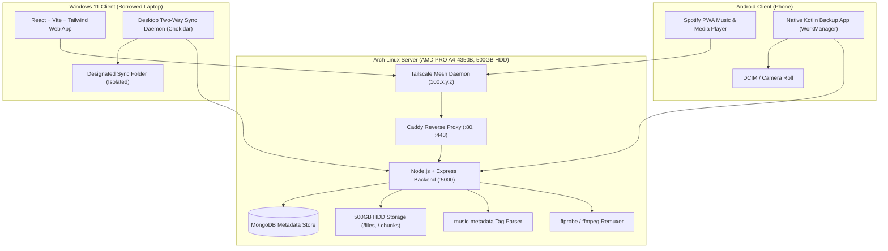

# Nexora — Self-Hosted Personal Cloud Suite
### Google Drive + Spotify + VLC Player (Self-Hosted on Arch Linux 500GB HDD)

Nexora is a high-performance, self-hosted personal cloud that replaces Google Drive with unlimited storage you control. It features an instant 60–120fps modern web interface, a Spotify-styled music player with ID3 metadata parsing, a VLC-equivalent media player with multi-audio/subtitle switching, an automated Android camera background backup module, and an isolated Windows 11 single-folder sync client.

---

## 🏛️ Architecture & Component Overview



---

## 📦 Monorepo Directory Structure

```
Nexora/
├── server/            # Node.js + Express backend with MongoDB & storage engines
│   ├── src/
│   │   ├── config/    # DB, storage paths, JWT secrets
│   │   ├── models/    # User, FileItem, Folder, Playlist, PlayProgress, SyncState
│   │   ├── routes/    # auth, files, upload, stream, music, video, sync, system
│   │   ├── services/  # chunkUploadService, musicMetadataService, mediaProbeService
│   │   ├── websocket/ # socket.io real-time multi-device sync
│   │   └── server.js  # Server entry point
├── web/               # React + Vite + TailwindCSS + TanStack Virtual + Lucide
│   ├── src/
│   │   ├── components/# Drive, Music, VLC Cinema, Modals, Virtual lists
│   │   ├── context/   # AuthContext, DriveContext, PlayerContext
│   │   ├── pages/     # DrivePage, MusicPage, VideoPage, SyncPage, LoginPage
│   │   └── services/  # api, socket, chunkUploader
├── android/           # Native Kotlin WorkManager camera roll background backup
│   ├── app/
│   │   └── src/main/java/com/nexora/backup/
│   │       ├── data/      # Room SQLite hash DB & Retrofit API client
│   │       ├── worker/    # Jetpack Coroutine MediaBackupWorker
│   │       ├── service/   # Foreground Service with upload progress
│   │       └── ui/        # Material 3 dark configuration UI
├── desktop-sync/      # Windows 11 isolated single-folder 2-way sync daemon
│   └── src/
│       ├── syncEngine.js  # Chokidar watcher & SHA256 differential sync
│       ├── apiClient.js   # HTTP sync client
│       └── setup.js       # Interactive CLI configuration wizard
└── deploy/            # Arch Linux systemd, Caddyfile, Tailscale scripts
    └── arch-linux/
        ├── nexora-server.service
        ├── Caddyfile
        ├── setup-arch.sh
        └── tailscale-setup.sh
```

---

## ✨ Features

### 1. Drive (File Management & Storage)
- **Virtual Directory Tree**: Browse folders, drag-and-drop, rename, move, delete, restore, and search.
- **Resumable Chunked Uploads**: 5MB slice streaming for multi-gigabyte video files that resumes seamlessly across network drops.
- **Storage Meter**: Live dashboard tracking physical HDD usage out of 500GB with category breakdown.

### 2. Music Player (Spotify Experience)
- **ID3 Tag Auto-Indexing**: Automatically parses Title, Artist, Album, Year, Genre, and extracts Album Artwork on upload.
- **Persistent Bottom Player Bar**: Smooth scrubber, volume slider, shuffle, repeat, and play queue.
- **Immersive Visualizer Modal**: Full-screen album art view with metadata bitrate readout.
- **Playlists & Liked Songs**: Instant library organization with optimistic UI feedback.

### 3. Video Player (VLC Cinema Experience)
- **Multi-Stream Inspection**: `ffprobe` enumerates all audio streams and embedded subtitle tracks at index time.
- **Audio & Subtitle Track Switching**: Dynamic WebVTT on-demand subtitle extraction and stream switching.
- **VLC Keyboard Conventions**: `Space` (play/pause), `← / →` (seek 5s), `Ctrl + ← / →` (seek 1m), `↑ / ↓` (volume), `M` (mute), `F` (fullscreen), `V` (cycle subtitles), `[ / ]` (playback speed).
- **Auto-Resume Progress**: Remembers playback timestamps per video in MongoDB.

### 4. Android Camera Roll Auto-Backup
- **WorkManager Foreground Sync**: Periodically scans `DCIM/Camera` in the background and uploads without requiring the app to stay open.
- **SHA-256 Deduplication**: Room SQLite database prevents redundant re-uploads.
- **Wi-Fi Only Toggle**: Prevents cellular data consumption.

### 5. Windows 11 Isolated Single-Folder Sync
- **Strict Boundary**: Watches and syncs *only* one designated folder on Windows (e.g. `C:\Users\User\NexoraSync`).
- **Two-Way Realtime Sync**: Uses Chokidar and SHA-256 diffing to sync bidirectionally with the Arch server.

---

## ⚡ Performance Architecture (60fps / 120fps)

- **Virtualized Rendering**: File lists and track tables use `@tanstack/react-virtual` to ensure 0 layout thrashing even with 10,000+ files.
- **GPU-Accelerated CSS**: All transitions run via `transform: translateZ(0)` and `opacity` to maintain 120fps display refresh rates.
- **Zero Live CPU Re-encoding**: Videos stream via HTTP 206 Partial Content byte ranges, keeping the modest AMD PRO A4-4350B CPU cool.

---

## 🚀 Quickstart for Local Development

### 1. Start the Backend Server
```bash
cd server
npm install
npm run dev
```

### 2. Start the React Frontend
```bash
cd web
npm install
npm run dev
```

Open `http://localhost:5173` in your browser.

---

## 🌐 Production Deployment on Arch Linux

Follow the complete step-by-step instructions in [deploy/README.md](file:///D:/Hari%20Haran/Nexora/deploy/README.md) or run:

```bash
chmod +x deploy/arch-linux/setup-arch.sh
./deploy/arch-linux/setup-arch.sh
```
